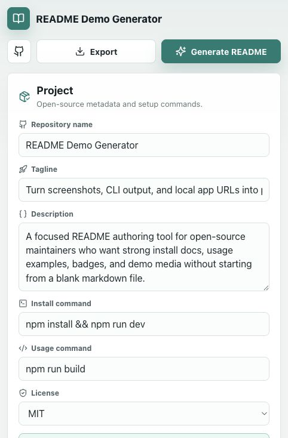

# README Demo Generator


Drop in screenshots, CLI output, or a local app URL, and generate a polished GitHub README with install steps, usage examples, GIF/image slots, and badges.

## Demo



## Features

- Project metadata fields for repo name, tagline, description, license, install command, and usage command
- Screenshot/GIF upload slots that flow into the generated README
- CLI output capture area formatted as markdown
- Local app URL field with a capture note action
- Live GitHub-style README preview
- Copy and download actions for `README.md`

## Installation

```bash
npm install
```

## Usage

```bash
npm run dev
```

Build for production:

```bash
npm run build
```

## Project Structure

```text
readme-demo-generator/
├── src/
│   ├── main.tsx
│   └── styles.css
├── index.html
├── package.json
└── README.md
```

## Contributing

Issues and pull requests are welcome. Please keep changes focused and include a short explanation of the README workflow you are improving.

## License

MIT
